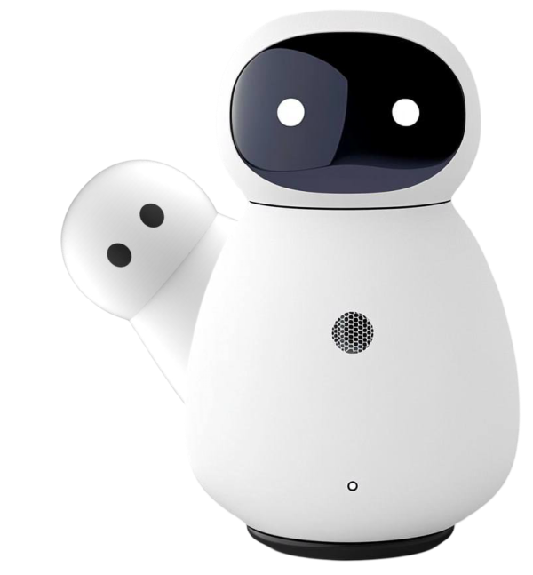

  

# Catherine AI
Catherine AI is a smart voice assistant for business designed to help entrepreneurs solve their tasks.

Catherine support AI conversions and has physical shell and looks like a robot. It is capable of performing various tasks such as answering customer questions, processing orders, managing schedules and more.
 Catherine is based on deep learning technology and can learn from its experience working with customers.

Catherine-AI can communicate with other business management systems such as CRM and ERP, which allows it to be even more useful for your business. In addition, Kate’s physical shell allows it to interact with customers in the real world, such as taking orders or providing information about products and services at trade shows and events. Kate can be configured to work in various industries such as retail, hospitality, healthcare, education and others. It can be useful for improving customer service, reducing labor costs and increasing the efficiency of business processes.

## Targeted technical capabilities

###  Voice control:
  - Speech recognition even in noisy rooms (noise reduction technology).
  - Multi-language support.
  - Adaptation to company terminology. You can add your own commands and agents.

### Integration:
 - API for connecting to CRM (Pipedrive, Salesforce, Bitrix24), calendars (Google Calendar, Outlook), ERP systems
 - Compatibility with IoT (smart sensors, cameras, printers).

### Security:
- Local data storage (no cloud).
- AES-256 encryption for confidential data.
- "Offline" mode: task management, access to a local knowledge base, offline analytics.
- Offline LLaMo model

### Analytics:
 - Generation of reports on tasks and time (voice requests like: "Catherine, please report on project XXX for March 2025").

## Physical shell
 Device description:

  - Minimalistic case design made of matte aluminum (colors: graphite, white, silver).
  - Dimensions: 12 × 12 × 3 cm (compact for placement on a table or wall mounting).
  - Microphones/speakers: 6-microphone array + stereo speakers with adjustable volume.
  - Ports: USB-C (charging), Ethernet (for a stable connection to a local network), HDMI (connection to a monitor).
  - Indicators: LED strip (blue — work, red — microphone off).

  - (Featured) Screen: 5″ touch display (for data visualization, but not required for voice control).

## Latest code updates
- VOSK audio model setted to *vosk-model-small-en-us-0.15*
- Added the core.all_num_to_text(text) function, which converts all numbers in the text for pronunciation. This is essential for the Silero TTS engine. It relies on the utils/all_num_to_text module.
- Now available as a Docker image!
- Jaa.py (Jaa Plugin Framework) updated to version 1.7.1.
- `runva_webapi.py` - Settings are now stored in `runva_webapi.json` and loaded using the new jaa.py.
- jaapy 2.2.0 - Correct handling of dict and list parameters in plugin options when editing them in the options manager.
- Alpha version of the plugin installer `runva_plugin_installer.py`.
- Fixed the cmdline option - now it takes context into account.
- Added context support (see the documentation).
- Demo games for context usage: "Higher-Lower" and "Higher-Lower Alternative" (two styles).
- Basic implementations now use context handling.
- `runva_webapi.py` - Calls to core._update_timers are now made via periodic HTTP requests and a timer. Webapi has become significantly more stable.
- `runva_voskrem.py` - Launcher for Catherine with voice recognition via VOSK Docker.

## Acknowledgments

- Catherine-AI Team
- Best regards to [Irina](https://github.com/janvarev/Irene-Voice) and [EnjiRouz](https://github.com/EnjiRouz)
- [Katusha](https://github.com/j0k/Katusha)
